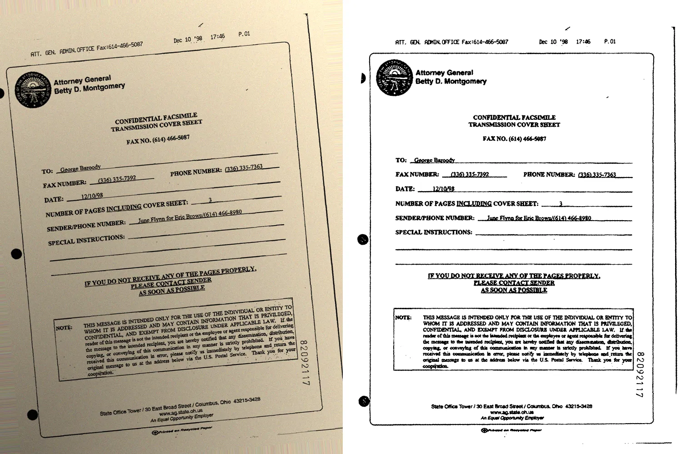

# Avaliação do pré-processamento com o dataset FUNSD

Este documento mede, com um dataset público, quanto o pipeline de processamento de imagens do NeXo Estudos melhora o reconhecimento de texto (OCR). Ele também registra como os parâmetros do pipeline foram escolhidos.

## Dataset utilizado

**FUNSD — Form Understanding in Noisy Scanned Documents**

- Página oficial: <https://guillaumejaume.github.io/FUNSD/>
- Download: <https://guillaumejaume.github.io/FUNSD/dataset.zip>
- Licença: <https://guillaumejaume.github.io/FUNSD/work/> — uso restrito a fins não comerciais, de pesquisa e educacionais.
- Referência: JAUME, Guillaume; EKENEL, Hazim Kemal; THIRAN, Jean-Philippe. *FUNSD: A Dataset for Form Understanding in Noisy Scanned Documents*. ICDAR-OST, 2019.

O FUNSD reúne 199 formulários reais digitalizados, com 31.485 palavras anotadas manualmente (texto e posição de cada palavra). Ele vem dividido em 149 imagens de treino e 50 de teste. As anotações servem como gabarito do texto que o OCR deveria reconhecer.

O dataset não é redistribuído neste repositório: o script `tools/avaliar_ocr.py` o baixa da fonte oficial para a pasta `datasets/`, que está no `.gitignore`.

## Metodologia

### Condições de teste

Cada imagem de teste é avaliada em duas condições:

1. **Scan original:** a imagem como está no FUNSD (digitalização em tons de cinza, com ruído típico de fax e scanner).
2. **Foto simulada:** a mesma imagem degradada para imitar uma foto de celular — papel amarelado, sombra partindo de um canto, ruído de sensor e inclinação aleatória entre 3° e 6°. A degradação usa uma semente fixa por imagem, então os resultados são reproduzíveis.

### Métodos comparados

- **Sem pré-processamento:** o Tesseract recebe a imagem diretamente.
- **Pipeline do projeto:** a imagem passa pela mesma função `processar()` usada pela API (`backend/processamento.py`) antes do Tesseract.

Nos dois casos o Tesseract usa a mesma configuração da aplicação: idiomas `por+eng` e `--psm 6`.

### Métrica

O texto reconhecido e o texto anotado são normalizados (minúsculas, sem acentos e sem pontuação) e divididos em palavras. Comparando os dois multiconjuntos de palavras:

- **Precisão:** das palavras que o OCR produziu, quantas existem no gabarito.
- **Revocação:** das palavras do gabarito, quantas o OCR encontrou.
- **F1:** média harmônica entre precisão e revocação.

A comparação não depende da ordem de leitura. Isso é importante em formulários, porque o Tesseract pode ler as colunas numa ordem diferente da anotação sem que isso seja um erro de reconhecimento.

### Separação entre ajuste e avaliação

Os parâmetros do pipeline foram escolhidos usando apenas **20 imagens do conjunto de treino**. As **50 imagens de teste** só foram usadas para medir o resultado final. Assim, o número reportado não foi "ajustado" para o próprio conjunto em que é medido.

## Resultados (conjunto de teste, 50 imagens)

Médias por imagem:

| Condição | Método | Precisão | Revocação | F1 |
|---|---|---|---|---|
| Scan original | Sem pré-processamento | 62,9% | 60,4% | 61,3% |
| Scan original | **Pipeline do projeto** | **70,7%** | **74,1%** | **72,1%** |
| Foto simulada | Sem pré-processamento | 43,6% | 27,9% | 32,4% |
| Foto simulada | **Pipeline do projeto** | **66,5%** | **69,4%** | **67,6%** |

- **Scan original:** o pipeline aumentou o F1 em 10,8 pontos percentuais. Melhorou 45 das 50 imagens (mediana do ganho: 6,4 p.p.).
- **Foto simulada:** o pipeline aumentou o F1 em 35,2 pontos percentuais. Melhorou 49 das 50 imagens (mediana do ganho: 35,2 p.p.).
- **Correção de inclinação:** nas fotos simuladas (inclinadas entre 3° e 6°), o erro médio do ângulo após a correção foi de 0,30°; 40 das 50 imagens ficaram com erro de até 0,5°.

Os resultados de cada imagem estão em [`avaliacao/resultados.csv`](avaliacao/resultados.csv).



*Imagem do conjunto de teste do FUNSD degradada para simular uma foto (esquerda) e o resultado do pipeline (direita): fundo uniforme, texto nítido e página alinhada.*

## O que a avaliação mudou no pipeline

A primeira execução desta avaliação mostrou que o pipeline original **piorava** o OCR: nos scans, o F1 caía de cerca de 68% (sem pré-processamento) para 32% no conjunto de treino. As causas encontradas foram:

1. **Letras pequenas demais:** nos formulários, as letras têm cerca de 10 pixels de altura. O limiar adaptativo e o filtro mediano afinavam e quebravam os traços.
2. **CLAHE realçando ruído:** o ajuste local de contraste amplificava a granulação do fundo, que virava pontilhado na binarização.
3. **Correção de inclinação instável:** o método do retângulo mínimo (`minAreaRect`) considerava bordas, linhas do formulário e sujeira, e media o ângulo da página inteira em vez do ângulo do texto.

Variantes testadas no conjunto de treino (F1 médio em 20 imagens):

| Variante | Scan original | Foto simulada |
|---|---|---|
| Sem pré-processamento | 68,2% | 32,8% |
| Pipeline original (CLAHE + mediana + limiar adaptativo + `minAreaRect`) | 32,4% | 10,3% |
| Ampliação + iluminação uniforme + CLAHE + mediana + Otsu | 75,6% | 71,6% |
| Ampliação + iluminação uniforme + CLAHE + mediana + limiar adaptativo | 72,7% | 11,6% |
| Iluminação uniforme + desfoque gaussiano + Otsu, **sem ampliação** | 48,6% | 46,2% |
| Ampliação + iluminação uniforme + desfoque gaussiano + Otsu | 77,0% | 75,5% |
| Ampliação + iluminação uniforme, OCR na imagem em cinza (sem binarizar) | 81,0% | 76,2% |
| **Ampliação + iluminação uniforme + mediana + Otsu (adotada)** | **77,1%** | **74,5%** |

Todas as variantes novas usam a correção de inclinação por projeção. A ampliação foi a mudança de maior impacto; a normalização de iluminação foi decisiva nas fotos. O CLAHE foi retirado porque, depois da normalização de iluminação, ele reduzia o F1.

Entregar ao Tesseract a imagem em cinza normalizada, sem binarizar, teve o maior F1 no treino, porque o próprio Tesseract faz uma binarização interna. Mesmo assim, o projeto mantém a binarização explícita com Otsu: ela é uma etapa central da disciplina, a imagem mostrada na interface passa a ser exatamente a que o OCR recebe, e a diferença nas fotos simuladas foi pequena (1,7 ponto).

## Limitações

- O FUNSD é composto por formulários em inglês. Materiais de estudo em português, com outra diagramação, podem ter resultados diferentes.
- As fotos são simuladas a partir dos scans. Fotos reais podem ter outros problemas, como perspectiva, desfoque de movimento e reflexos.
- A métrica por palavras não penaliza erros de ordem de leitura e trata cada palavra como certa ou errada, sem considerar acertos parciais de caracteres.

## Como reproduzir

Na raiz do projeto, com o ambiente virtual ativo e o Tesseract instalado:

```powershell
python tools/avaliar_ocr.py
```

O script baixa o FUNSD (cerca de 16 MB) se ainda não estiver em `datasets/`, avalia as 50 imagens de teste (alguns minutos), imprime a tabela de resultados e grava `docs/avaliacao/resultados.csv` e a figura de exemplo.
