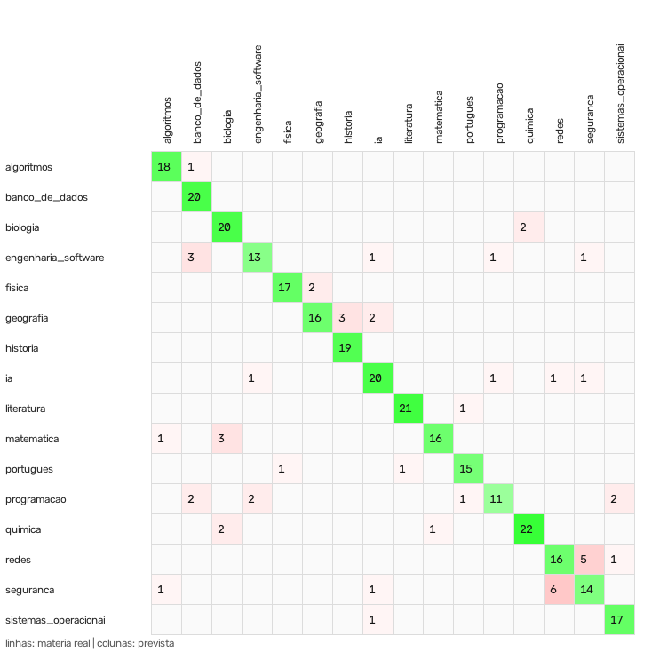

# Classificador de matérias do Assistente de Estudos

O Assistente de Estudos identifica a matéria do texto reconhecido pelo OCR para escolher as sugestões de
estudo. Até esta versão isso era feito só por **regras de palavras-chave**. Agora a decisão é de um
**modelo de aprendizado de máquina treinado e avaliado**, com as regras como reserva.

## Dataset

- **Fonte:** introduções de artigos da Wikipédia em português, coletadas pela API pública do MediaWiki a partir
  de categorias ligadas a cada matéria (`tools/montar_dataset_materias.py`). Licença CC BY-SA 4.0
  (ver [`datasets/README.md`](../datasets/README.md)).
- **Arquivo:** [`datasets/materias_wikipedia.jsonl`](../datasets/materias_wikipedia.jsonl).
- **Tamanho:** 1.635 trechos de até 120 palavras, de artigos diferentes, em **16 matérias** (83 a 128 trechos por
  matéria).
- **Cuidado na coleta:** as categorias de cada matéria são intercaladas. Na primeira versão, a lista alfabética de
  linguagens de programação ocupava sozinha a matéria "Programação", e os artigos sobre orientação a objetos foram
  rotulados como "Engenharia de Software"; um teste automático revelou o problema.

## Modelo

| Etapa | Escolha | Motivo |
|---|---|---|
| Pré-processamento | minúsculas, sem acentos | o OCR erra muito acentos |
| Representação | TF-IDF de palavras (1 e 2 palavras) + TF-IDF de n-gramas de caracteres (3 a 5) | os n-gramas de caracteres reconhecem pedaços de palavras mesmo com letras trocadas pelo OCR |
| Classificador | Regressão Logística | dá probabilidades, usadas como confiança |
| Uso no app | só decide com confiança ≥ 0,4 e texto com 15+ palavras | abaixo disso, o assistente volta às regras |

## Avaliação

A separação treino/teste é **por artigo** (`StratifiedGroupKFold`): trechos do mesmo artigo nunca ficam nos dois
lados, para a nota não ser inflada. Teste: 327 trechos de artigos que o modelo nunca viu.

A coluna "com ruído de OCR" aplica ao texto de teste erros típicos de OCR (troca de letras parecidas, como `o`→`0`
e `l`→`1`, letras perdidas e palavras grudadas, em 8% dos caracteres).

| Método | Acurácia | F1 macro | Acurácia com ruído de OCR |
|---|---|---|---|
| Regras de palavras-chave (versão anterior) | 51,1% | 48,9% | 41,9% |
| Naive Bayes (TF-IDF) | 84,4% | 83,7% | 81,0% |
| SVM linear (TF-IDF) | 85,3% | 85,2% | 82,0% |
| **Regressão Logística (TF-IDF) — adotada** | **84,1%** | **84,0%** | **82,9%** |

Os três modelos ficam próximos; a Regressão Logística foi adotada por ser a mais estável com ruído de OCR e por
fornecer probabilidades diretamente. Com o modelo, a acurácia sobe cerca de 33 pontos e quase não cai com os erros do
OCR (−1,2 ponto, contra −9,2 das regras).

**Confiança:** com o limiar de 0,4 usado no app, o modelo decide em 70% dos textos de teste e acerta **93,4%**
deles; nos demais, valem as regras.

| Confiança mínima | Textos decididos pelo modelo | Acurácia nesses textos |
|---|---|---|
| 0,3 | 80,7% | 91,3% |
| **0,4** | **70,0%** | **93,4%** |
| 0,5 | 57,2% | 94,1% |
| 0,6 | 45,6% | 96,0% |

### Por matéria (F1 no teste)

Melhores: Literatura (95,5%), História (92,7%), Algoritmos (92,3%), Física (91,9%). Mais difíceis: Segurança da
Informação (65,1%), Programação (71,0%), Redes (71,1%) e Engenharia de Software (74,3%), matérias com vocabulário
compartilhado.



A maior confusão é entre **Redes** e **Segurança da Informação** (11 trechos), o que é esperado: muitos textos de
segurança tratam de protocolos de rede.

## Limitações

- O treino usa texto enciclopédico (Wikipédia); páginas de apostila têm outro estilo. A avaliação com ruído simulado
  aproxima, mas não substitui, um teste com páginas reais fotografadas.
- Textos fora das 16 matérias são classificados na mais parecida; o limiar de confiança reduz, mas não elimina,
  esses casos.

## Reproduzir

```powershell
python tools/montar_dataset_materias.py   # opcional: coleta o dataset de novo
python tools/treinar_classificador.py     # treina, avalia e salva backend/modelos/classificador_materias.joblib
```

Os números completos ficam em [`docs/classificador/resultados.json`](classificador/resultados.json).
